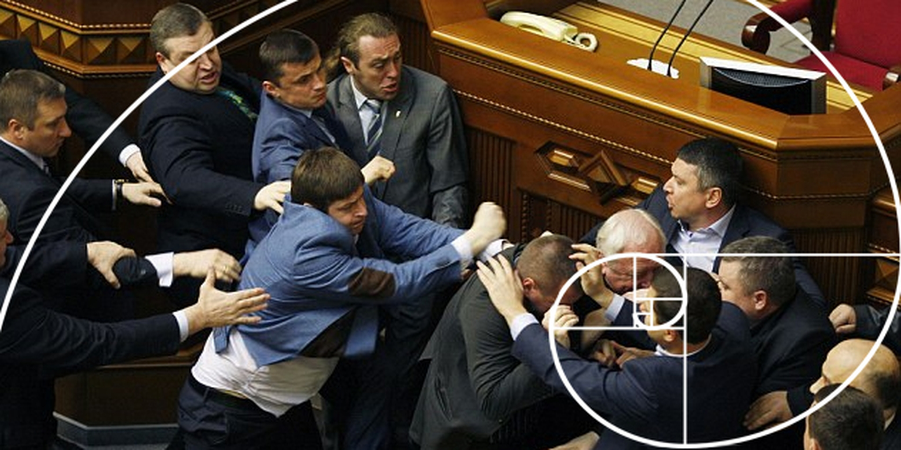
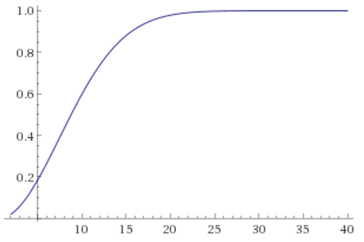

# Meditation on group communication #

*A “[Polish parliament](https://en.wikipedia.org/wiki/Polish_parliament_%28expression%29?oldformat=true)” (Actually the photo is of [the Ukrainian one](https://www.dailydot.com/unclick/ukranian-government-fistfight-turned-into-painting/))*

**I want to share some thoughts on participants and information in group communication - There are lots of other fascinating aspects of communication in general - discourse, purpose, timeliness etc. but this time around, I needed to speak about how groups communication differ from one-on-one conversations.**

*Throwing out some basic principles I consider facts:*

* **Three or more people form a group** - I have shared thoughts elsewhere on why three is my favorite group but essentially three to five people are a small group, six to circa 20 is the group size I will be discussing below, above that are big groups and mass meetings I don't trouble myself with
* **Fairly or not, in a group attention is shared between participants** - Assuming equal shares of attention, as a group grow the proportion shrink rapidly to then taper of to a small fraction of total attention. Also, attention is both claimed and granted - if anyone claims it unfairly others naturally exhibit their disapproval by allowing distraction, annoyance or simply refusing to participate in what feels like a waste of their attention

   

   *[Equal share of attention as a function of group size](https://www.wolframalpha.com/input/?i=plot+1%2Fx,+x%3D2+to+40)*

* **Group coherence is pleasant, but stands opposed to capacity** - A group of twenty people in a room can practically only have one conversation at a time, whereas if they were to divide into five groups of four people there could be five conversations simultaneously, each in which the participants would have five times the attention share (be it from a fifth the people but that is less significant)! In the larger group, potentially everyone would get to take part in the creation of the same most excellent thoughts (drawing from the collective contributions) but because larger groups drastically limit the communication capacity and attention shares, care should be taken so that attention is not squandered. Interestingly, I think this principle applies also to public discourse - the more people are connected and discuss the same things, the less things they are able to discuss
* **As a group expand, conflicts are inevitable** - Due to nonlinear quirks of statistics that are best described as [the birthday paradox](https://betterexplained.com/articles/understanding-the-birthday-paradox/), because serious disagreements or conflicts may exhibit between any participants they become very likely much sooner than expected by linear intuition. For instance assuming that people will conflict with one person in 50, already at a group size of 17 people, the risk of a conflict between any two in the group reach above 95%. Any group dynamic hoping to succeed needs measures to cope with this

   

   *[The likelihood of conflict as a function of group size](https://www.wolframalpha.com/input/?i=plot+(1-(1-k)%5E((x*(x-1))%2F2)),+x%3D2+to+40,+k%3D1%2F50), given an individual likelihood of 1/50*
   
* **Larger groups have more to contribute** - It may be obvious, but especially given the considerations above, it may become a challenge that everyone have their own experiences, their own favorite books, movies etc. Not everyone will have read the philosopher you are quoting and can't judge it in context, or may even nurture strong objections to something that you weren't even quoting by that author. All these thoughts can be a treasure trove or a source of distraction and disruptions to progress in conversations. Especially considering the information abundance we are immersed in it is not unreasonable to expect participants to discriminate between that recent thing they heard and a genuinely relevant thought of their own (to the degree original thoughts are possible beyond crossbreeding of memes). It is also relevant to share as much as possible of the origin of a thought in order for others to understand it in context 

The consequences of failing these considerations are obvious to anyone who have experienced the distinction between a torturous meeting and an enjoyable or even magical one. Group conversations do not come easy, and it is natural to struggle for attention, face conflicts and get lost among hectic topics. Unless we create the most rewarding, best possible space we can, people will not care to show up and hostility will dominate over cohesion.

There are a number of things you can do to cope with these dynamics - essentially working around the issues above or working with smaller groups.

Dividing into smaller group can enable more participation and diverse conversations, but unless you can summarize and bring those thoughts back you lose out on the benefits of a large group of participants to begin with - that everyone become aware of the diverse perspectives and their points of mutual agreement.

Because attention rapidly becomes scarce as a group grows, one strategy is to face that head on. When you are not being heard and the conversation is heading away from your participation, it is common to react with stress and agitation. One workshop made a ritual of every other statement suggesting *"Let's everybody take a deep breath"*. Sure enough it felt peculiar especially as the breaths were noisy and expressive - but the regular interruption and enforced introspection managed very well to defuse the stress of communication. There is not room for everyone to share their every thought - so let us make the best of it.

The Quaker "Religious Society of Friends" have established [a similar ritual for their services](http://gamestorming.com/games-for-any-meeting/knowledge-game-quaker-conversation/). Everyone are equal and may speak in such meetings and space for quiet reflection is essential. Once you have formulated and shared your thoughts, everyone are aware that you are not supposed to speak until the next "round" (however that is defined), so debate is not an option but one is encouraged to build and improve on the statements of previous speakers.

Regarding disagreement and conflict, according to the principles of [self-reliance and self-expression](https://burningman.org/culture/philosophical-center/10-principles/) it is my conviction that in a [panarchy](https://en.wikipedia.org/wiki/Panarchy?oldformat=true) of opportunities, it is futile to coerce anyone to change - if they share space with you there is opportunity to influence them but push too hard and that space will no longer exist. There is also the issue of objecting, where I have started to confront what I consider stupidity mainly with silence and disinterest. Since I rely on that the group around me is at least as wise as I am, it is a great satisfaction when attention is not wasted on something irrelevant, but it falls to the floor and is ignored. That way, even if I was wrong, I can stay on topic and focus on my own dreams and have not caused unnecessary disruption. **In summary, that is my dream for our group communication, that I may grow in understanding and enable others to grow. No more and no less. Thank you for your attention.**

*These thoughts are my own provided [for any purpose by attribution](https://creativecommons.org/licenses/by/2.0/), inspired by:*

* The [Philosophy Gatherings](https://www.facebook.com/groups/1342182329143737/?fref=ts) at the [Syntheist Node in Sickla, Stockholm](https://www.facebook.com/noden.sthlm/?fref=ts)
* Ladislaus Horatius' lecture on his ["Mindfulosophy"](https://www.facebook.com/Visdomsgille-Mindfulosophy-1216582355070855/) at the Node
* Experiences from conversation dynamics in the [Stockholm Poly community](https://www.facebook.com/groups/782794128416452/?fref=ts)
* Teal practices in [Reinventing Organizations](http://www.reinventingorganizationswiki.com/Main_Page), [Open Participatory Organizations](https://medium.com/open-participatory-organized/a-manifesto-for-open-participation-60b62d327684) and the [Burning Man community](https://burningman.org/culture/philosophical-center/10-principles/)
* [Nonviolent communication](https://en.wikipedia.org/wiki/Nonviolent_Communication?oldformat=true) by Marshall Rosenberg
* [Principles of mindful meetings](https://www.psychologytoday.com/blog/wired-success/201510/how-bring-mindfulness-meetings-10-tips) (another [outline in Swedish](https://alexhirschi.blogspot.se/2013/11/motesteknik-for-att-undvika-polsk.html))
* My understanding of [information theory](https://en.wikipedia.org/wiki/Information_theory?oldformat=true) and [cellular networks](https://en.wikipedia.org/wiki/Cellular_network?oldformat=true)

*This article was authored in [shamblespad](http://shamblespad.com/p/group_communication), stored in [Github](https://github.com/UncleCJ/syntheism/blob/UncleCJ-patch-1/Group%20communication.md) and published on [Medium](https://medium.com/@unclecj/meditation-on-group-communication-2715520e3a7e)*