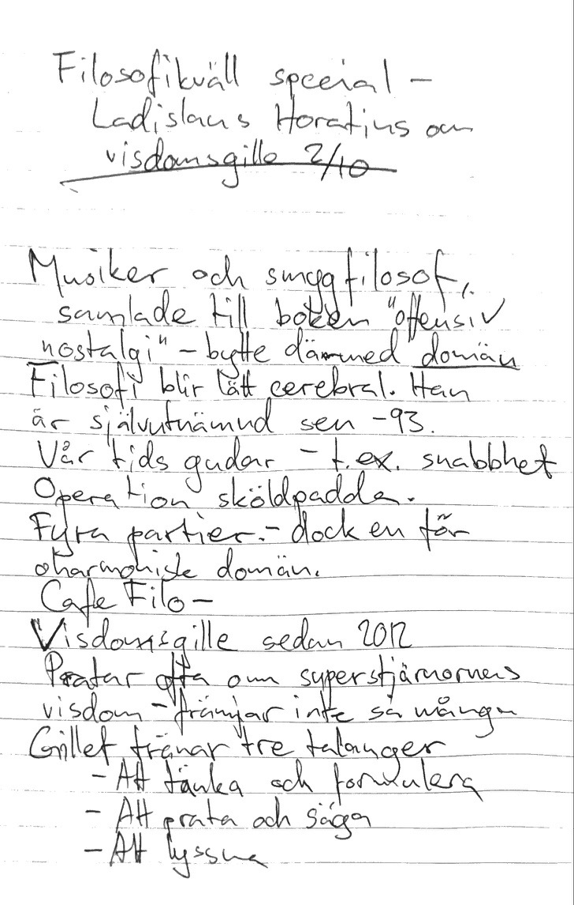

# Philosophy gathering special (#11?) - Ladislaus Horatius

*[2016-10-02](https://www.facebook.com/events/687513538080447/)* 

*This seminar was held in Swedish by the philosopher Ladislaus Horatius visiting Noden - thus the notes are in Swedish but for accessibility they will as soon as possible be translated to English*

## Föreläsning om "visdomsgille" 

Musiker och smygfilosof, samlade till boken "offensiv nostalgi" och bytte därmed **domän**. Filosofi blir lätt cerebral men det kan också vara vardagsnära och praktisk.

Ladislaus är självutnämnd filosof sedan 1993.

Vår tids gudar - t.ex. snabbhet. Operation Sköldpadda.

Har startat fyra partier - politiken är dock en för oharmonisk domän.

Café Filo och **Visdomsgille** sedan 2012 (för tillfället dock vilande).

Vi pratar ofta om superstjärnornas visdom (Einstein, Dalai Lama med flera), men det främjar inte så många.

Gillet tränar tre talangar:

 * Att tänka och formulera
 * Att prata och säga
 * Att lyssna

Sammantaget resulterar Gillet i **interligens** (ibland behöver man hitta på ord). Inte för att deltagare ska tänka lika, men det är ett slags vänligt samtänkande.

Att inte trampa på minorna, att hitta möjligheterna och nya fräscha idéer. Man kan tänka sig filosofi med respektive utan **Känn Dig Själv**.

Böckernas roll i filosofin är kopplad till rädslan för filosofin. Böcker kan vara något av en schauvinistisk grej och Gillet tillämpar i princip **bokförbud** (det är mer nyanserat än så, men en egen tanke är klart mer uppskattad än ett klyftigt citat).

Frågvishet - vi fokuserar för mycket på **ekvationens högerled**. Istället för att omedelbart söka svar borde vi fokusera mer på bra frågor.

Skrämmande frågor. Hjälpsamhet och vardagsfilosofi. Gillet är inte "drop in" - man tillämpar en slags audition. Tre timmars samtal är inte så lång tid om man ska räkna in associationer - vad var egentligen frågan?

Papper och penna - för att tvinga ned munnen på djup visdom.

"Ta fem minuter och skriv" - man kan då notera olika betéenden:

* Skriver direkt
* Tänker först och skriver sen
* Skriver direkt, men blir otålig att tiden inte är slut och kommer på mer och skriver igen

Om man liknar samtalet vid en bilresa kan man tänka sig tre värdefulla instrument:

* Hastighet - är uttalandet en **reflex**, **reaktion** eller en **respons**?
* Temperatur - kommer uttalandet ur en **fire** eller **water** mind?
* GPS (Mental Positioning System) - kommer uttalandet ur **tanke-skafferiet** eller **tänkandet**?

**Salivframkallande tankekomplex** och floskler som vill få oss att inte tänka.

Det går inte att läsa om hur Gillet är, det måste upplevas och låta sig överraskas.

Bonding i samtalet - vi söker instinktivt samhörighet, men den behöver inte vara äkta. Vi behöver inte varandra som kryckor.

Forcera inte slutsatser och koncensus.

Blotta inte alla tankar.

Telekommunikation betyder bokstavligen fjärrkommunikation - detta är **närkommunikation**. Händelsevis existerar också autokommunikation.

Att söka **responsen** (se **Hastighet** ovan) undviker konflikter (*Anm. och är en central komponent i Kväkarnas sätt att samtala*).

Arbetet med papper och penna redovisas i turordning, det behövs ingen moderator. Man filar på formuleringar omedelbart.

Interligens är som en konsert, inte en tävling.

Varför så få kvinnor inom filosofin? En spekulation - män fäktas och debatterar gärna?

Hur blir vi bättre på att lyssna? Flytta fokus till att **bygga** vårt tillstånd hellre än att kommunicera det.

"Talpinnen" kan bli en fetisch, undvik den.

5-7 personer i Gillet. För 10 personer räcker inte tre timmar till.

   *"I livets teater är endast Gud och änglarna åskådare" - [Francis Bacon](https://www.brainyquote.com/quotes/quotes/f/francisbac166297.html)*

I interligens är deltagande nödvändigt.

Mötet var ickekommersiellt men Horatius uppskattar bidrag för omkostnader etc på **Swish: 0736-004465**